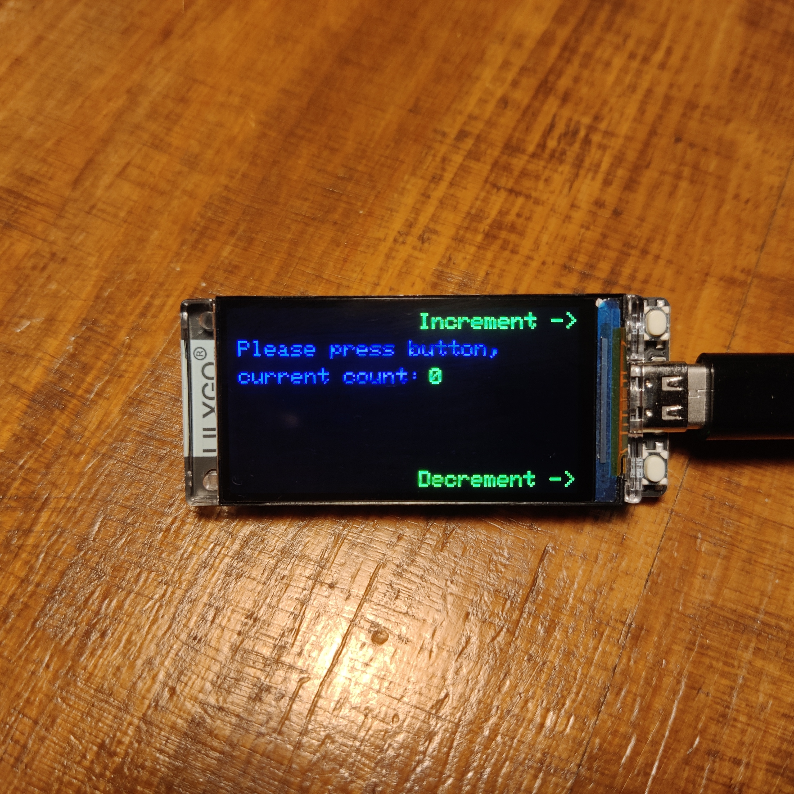

# README

Counter application for Lilygo T-Display-S3.

The Lilygo T-Display-S3 consists of an ESP32-S3R8 and a ST7789.

## Functionality

The application uses the two onboard buttons to increment or decrement a counter.

## Platform

The application was developed with PlatformIO using the Arduino framework.